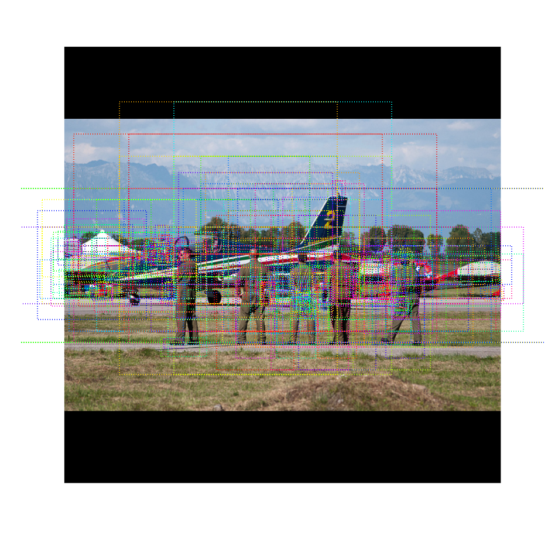

# Mask R-CNN for Object Detection and Segmentation


这是 [Mask R-CNN](https://arxiv.org/abs/1703.06870) 基于Python3、Keras、TensorFlow 的实现。 该模型为图像中对象的每个实例生成边界框和分割掩码。 它基于特征金字塔网络 (FPN) 和 ResNet101 主干。


这个仓库包括：
* 基于 FPN 和 ResNet101 的 Mask R-CNN 源代码
* MS COCO数据集的训练代码
* MS COCO数据集的预训练权重
* 使用Jupyter notebooks 去可视化目标检测的每一个步骤
* 用于多GPU训练的ParallelModel类
* 对MS COCO数据集进行评估(AP)
* 在自己的数据集上进行训练的示例


该代码文件化的设计易于扩展。 如果你在你的研究中使用它，请考虑引用这个仓库（下面的 bibtex）。 如果您从事 3D 视觉工作，您可能会发现我们最近发布的 [Matterport3D](https://matterport.com/blog/2017/09/20/announcing-matterport3d-research-dataset/) 数据集也很有用。 该数据集是根据我们的客户捕获的 3D 重建空间创建的，这些客户同意将它们公开用于学术用途。 您可以在[此处](https://matterport.com/gallery/)查看更多示例。

# 入门
* [demo.ipynb](samples/demo.ipynb) 是最简单的开始方式。 它展示了使用在 MS COCO 上预训练的模型来分割您自己图像中的对象的示例。 它包括在任意图像上运行对象检测和实例分割的代码。

* [train_shapes.ipynb](samples/shapes/train_shapes.ipynb) 展示了如何在您自己的数据集上训练 Mask R-CNN。 笔记还介绍了一个玩具数据集 (Shapes) 来演示对新数据集的训练。

* ([model.py](mrcnn/model.py), [utils.py](mrcnn/utils.py), [config.py](mrcnn/config.py)): 这些文件包含主要的 Mask RCNN 实现。

* [inspect_data.ipynb](samples/coco/inspect_data.ipynb). 该笔记可视化了准备训练数据的不同预处理步骤.

* [inspect_model.ipynb](samples/coco/inspect_model.ipynb) 笔记深入介绍了为检测和分割对象而执行的步骤。 它提供了流程上每一步的可视化。

* [inspect_weights.ipynb](samples/coco/inspect_weights.ipynb)
这个笔记检查训练模型的权重，并查找异常和奇怪的模式。


# 检测步骤
为了帮助调试和理解模型，有 3 个笔记本([inspect_data.ipynb](samples/coco/inspect_data.ipynb), [inspect_model.ipynb](samples/coco/inspect_model.ipynb),
[inspect_weights.ipynb](samples/coco/inspect_weights.ipynb))提供了大量可视化并允许逐步运行模型以检查每个点的输出。 这里有一些例子：


## 1. Anchor sorting and filtering（锚框的排序和筛选）
可视化第一阶段区域提议网络的每一步，并显示正锚和负锚以及锚框的优化。


## 2. Bounding Box Refinement（边界框的优化）
这是最终检测框（虚线）和第二阶段应用于它们的细化（实线）的示例。


## 3. Mask Generation （生成掩码）
生成的掩码示例。 然后将它们缩放并放置在正确位置的图像上。


## 4.Layer activations （层激活）
通常检查不同层的激活以寻找问题的迹象（全零或随机噪声）很有用。


## 5. Weight Histograms （权重直方图）
另一个有用的调试工具是检查权重直方图。 这些包含在inspect_weights.ipynb 笔记本中。


## 6. Logging to TensorBoard
TensorBoard 是另一个很棒的调试和可视化工具。 该模型被配置为在每个 epoch 结束时记录损失并保存权重。


## 6. Composing the different pieces into a final result（将不同的部分组合成最终结果）


# 在MS COCO数据集上进行训练
我们提供MS COCO预训练的权重，以使其更容易开始。 您可以使用这些权重作为起点，在网络上训练您自己的变体。 训练和评估代码在 `samples/coco/coco.py` 中。 您可以在 Jupyter 笔记本中导入此模块（请参阅提供的笔记本以获取示例），也可以直接从命令行运行它，如下所示：

```
# 从预训练的 COCO 权重开始训练新模型
python3 samples/coco/coco.py train --dataset=/path/to/coco/ --model=coco

# 从预训练的 ImageNet 权重开始训练新模型
python3 samples/coco/coco.py train --dataset=/path/to/coco/ --model=imagenet

# 继续训练您之前训练过的模型
python3 samples/coco/coco.py train --dataset=/path/to/coco/ --model=/path/to/weights.h5

# 继续训练您训练的最后一个模型。 这会查找模型目录中最后训练的权重
python3 samples/coco/coco.py train --dataset=/path/to/coco/ --model=last
```

你还可以使用以下命令运行COCO评估代码:
```
# 在最后一个训练模型上， 运行COCO评估代码
python3 samples/coco/coco.py evaluate --dataset=/path/to/coco/ --model=last
```

训练明细、学习率和其他参数在 `samples/coco/coco.py` 中设置。


# 在自己的数据集上进行训练
首先阅读这篇关于[气球颜色飞溅示例的博客文章](https://engineering.matterport.com/splash-of-color-instance-segmentation-with-mask-r-cnn-and-tensorflow-7c761e238b46)。 它涵盖了从标注图像到训练再到在示例应用程序中使用结果的过程。

总之，要在您自己的数据集上训练模型，您需要扩展两个类：

```Config``` 此类包含默认配置。 将其子类化并修改您需要更改的属性。

```Dataset``` 此类提供了处理任何数据集的一致方式。 它允许您使用新的数据集进行训练，而无需更改模型的代码。 它还支持同时加载多个数据集，这在您要检测的对象并非都在一个数据集中可用时非常有用。

在 `samples/shapes/train_shapes.ipynb`, `samples/coco/coco.py`, `samples/balloon/balloon.py`, `samples/nucleus/nucleus.py`中查看示例。

## 和官方论文的不同之处
此实现在很大程度上遵循 Mask RCNN 论文，但在少数情况下，我们更偏向代码的简单性和泛化性。 这些是我们所知道的一些差异。 如果您遇到其他差异，请告诉我们。

* **Image Resizing:** 为了支持每批训练多个图像，我们将所有图像调整为相同的大小。 例如，MS COCO 上的 1024x1024px。 我们保留纵横比，如果图像不是方形的，我们用零填充它。 在论文中，调整大小使得最小边为 800px，最大边为 1000px。

* **Bounding Boxes**: 有些数据集提供边界框，有些只提供掩码。 为了支持对多个数据集的训练，我们选择忽略数据集附带的边界框，而是即时生成它们。 我们选择掩码所有像素的最小外接框作为边界框。 这简化了实现，也使应用图像增强变得容易，否则很难应用到边界框，例如图像旋转。
为了验证这种方法，我们将计算出的边界框与 COCO 数据集提供的边界框进行了比较。 我们发现大约 2% 的边界框相差 1px 或更多，大约 0.05% 相差 5px 或更多，只有 0.01% 相差 10px 或更多。

* **Learning Rate:** 论文使用了 0.02 的学习率，但我们发现它太高了，并且经常导致权重爆炸，尤其是在使用小批量时。 这可能与 Caffe 和 TensorFlow 计算梯度（跨批次和 GPU 的总和与均值）之间的差异有关。 或者，也许官方模型使用梯度裁剪来避免这个问题。 我们确实使用了渐变剪裁，但不要设置得太激进。 我们发现较小的学习率无论如何收敛得更快，所以我们继续这样做。

## 引用
使用这个仓库请添加如下参考:
```
@misc{matterport_maskrcnn_2017,
  title={Mask R-CNN for object detection and instance segmentation on Keras and TensorFlow},
  author={Waleed Abdulla},
  year={2017},
  publisher={Github},
  journal={GitHub repository},
  howpublished={\url{https://github.com/matterport/Mask_RCNN}},
}
```

## 贡献
欢迎对此存储库做出贡献。 你可以贡献的东西的例子：
* 速度改进。 比如使用 TensorFlow 或 Cython 重写一些 Python 代码。
* 在其他数据集上进行训练.
* 精度优化.
* 可视化和示例.

您也可以加入[我们的团队](https://matterport.com/careers/)，帮助我们构建更多这样的项目。

## 依赖
- Python 3.4
- TensorFlow 1.3
- Keras 2.0.8 
- other common packages listed in `requirements.txt`.

### MS COCO 依赖:
要在 MS COCO 上进行训练或测试，您还需要:
* pycocotools (安装方案如下)
* [MS COCO Dataset](http://cocodataset.org/#home)
* 下载 5K [minival](https://dl.dropboxusercontent.com/s/o43o90bna78omob/instances_minival2014.json.zip?dl=0)
  和 35K [validation-minus-minival](https://dl.dropboxusercontent.com/s/s3tw5zcg7395368/instances_valminusminival2014.json.zip?dl=0)
  subsets. 更多实现细节在 [Faster R-CNN implementation](https://github.com/rbgirshick/py-faster-rcnn/blob/master/data/README.md).

如果你使用 Docker, 可以在
[这个 Docker 容器](https://hub.docker.com/r/waleedka/modern-deep-learning/) 中验证代码是否可以工作。


## 安装
1. 克隆这个仓库
2. 安装依赖
   ```bash
   pip3 install -r requirements.txt
   ```
3. 在仓库的根目录运行安装程序
    ```bash
    python3 setup.py install
    ``` 
4. 从 [releases page](https://github.com/matterport/Mask_RCNN/releases) 下载MS COCO数据集的预训练权重(mask_rcnn_coco.h5)。
5. (可选) 要在COCO数据集上训练和测试，需要安装 `pycocotools` 库. 这个仓库是从原始的 `pycocotools` fork的一个分支，并修复了在python3和windows上的一些问题。 (原始仓库似乎不再更新和维护).

    * Linux: https://github.com/waleedka/coco
    * Windows: https://github.com/philferriere/cocoapi.
   你的路径必须有 Visual C++ 2015 编译工具。 (详情参加仓库内容)

# 使用这个模型的项目
如果你使用这个模型训练其他数据集或者构建其他项目， 我们很高兴听取你的想法.

### [4K Video Demo](https://www.youtube.com/watch?v=OOT3UIXZztE) by Karol Majek.
[](https://www.youtube.com/watch?v=OOT3UIXZztE)

### [Images to OSM](https://github.com/jremillard/images-to-osm): Improve OpenStreetMap by adding baseball, soccer, tennis, football, and basketball fields.


### [Splash of Color](https://engineering.matterport.com/splash-of-color-instance-segmentation-with-mask-r-cnn-and-tensorflow-7c761e238b46). A blog post explaining how to train this model from scratch and use it to implement a color splash effect.


### [Segmenting Nuclei in Microscopy Images](samples/nucleus). Built for the [2018 Data Science Bowl](https://www.kaggle.com/c/data-science-bowl-2018)
Code is in the `samples/nucleus` directory.


### [Detection and Segmentation for Surgery Robots](https://github.com/SUYEgit/Surgery-Robot-Detection-Segmentation) by the NUS Control & Mechatronics Lab.


### [Reconstructing 3D buildings from aerial LiDAR](https://medium.com/geoai/reconstructing-3d-buildings-from-aerial-lidar-with-ai-details-6a81cb3079c0)
A proof of concept project by [Esri](https://www.esri.com/), in collaboration with Nvidia and Miami-Dade County. Along with a great write up and code by Dmitry Kudinov, Daniel Hedges, and Omar Maher.


### [Usiigaci: Label-free Cell Tracking in Phase Contrast Microscopy](https://github.com/oist/usiigaci)
A project from Japan to automatically track cells in a microfluidics platform. Paper is pending, but the source code is released.

 

### [Characterization of Arctic Ice-Wedge Polygons in Very High Spatial Resolution Aerial Imagery](http://www.mdpi.com/2072-4292/10/9/1487)
Research project to understand the complex processes between degradations in the Arctic and climate change. By Weixing Zhang, Chandi Witharana, Anna Liljedahl, and Mikhail Kanevskiy.


### [Mask-RCNN Shiny](https://github.com/huuuuusy/Mask-RCNN-Shiny)
A computer vision class project by HU Shiyu to apply the color pop effect on people with beautiful results.


### [Mapping Challenge](https://github.com/crowdAI/crowdai-mapping-challenge-mask-rcnn): Convert satellite imagery to maps for use by humanitarian organisations.


### [GRASS GIS Addon](https://github.com/ctu-geoforall-lab/i.ann.maskrcnn) to generate vector masks from geospatial imagery. Based on a [Master's thesis](https://github.com/ctu-geoforall-lab-projects/dp-pesek-2018) by Ondřej Pešek.

